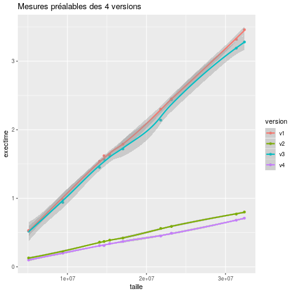

# P4a : Analyse de performances de différentes structures

[Grille d'évaluation P4a](https://docs.google.com/spreadsheets/d/1x72glVEQHPx56Wr8G0RNQgfQXGX6xCsjms_6b7J6si0/edit?usp=sharing
)

## Problème

Description du Problème.

Nous analysons dans cette étude les performances des différents type de structure en JAVA. Pour ce faire, nous allons tester les structures à travers plusieurs opération, et comparer leur temp d'execution et leur alocation mémoire. 

Nous allons tester les trois structures suivantes : "ArrayList", "HashMap" et "Array". 

Nous allons confronter ces structures à travers 5 opérations : "contains", "remove", "getFirst", "getRandom" et "getLast".

L'objectif de cette étude est d'aider à la décision lorsqu'il s'agira de choisir une structure de données. 

Quelle est la structure la plus performante dans tel ou tel contexte ?


## Dispositif expérimental

### Application

[code source de l'application](https://git.unistra.fr/nderousseaux/P4a/-/tree/master/src)
```
Usage : java testList structure operation taille

structure : Type de la structure, peut prendre les valeurs suivantes
    ArrayList
    HashMap
    Array

operation : Type d'opération testé sur la structure, peut prendre les valeurs suivantes :
    contains : Teste si une valeur apparait dans la structure. La valeur est définie aléatoirement.
    remove : Supprime toutes les occurences d'une certaine valeur dans la structure. La valeur est définie aléatoirement.
    getFirst : Accède au premier élément de la structure.
    getRandom : Accède a l'élément d'index n de la structure. n est définit aléatoirement.
    getLast : Accède au dernier élément de la structure.


taille : Taille de la structure.
```

### Environnement de test

Description de la plateforme de test
```
cpu family      : 23
model name      : AMD Ryzen 5 2600 Six-Core Processor @ 3.40GHz
cpu MHz         : 3400.000
cache size      : 512 KB
cpu cores       : 6
```

### Description de la démarche systématique

Description de la démarche systématique et de l'espace d'exploration pour chaque paramètres.

```
#!/bin/bash

cd src
javac *.java


test() {

    res=`(/usr/bin/time -f"%U\t%M" java testList $1 $2 $3> /dev/null) 2>&1`
    echo -e "$1\t$2\t$3\t$res"
    echo -e "$1\t$2\t$3\t$res" >> ../graphs/results
}

rm ../graphs/results
touch ../graphs/results

randomMax=10000

echo -e "struct\toperation\tsize\ttmp\tmem" >> ../graphs/results

for taille in $(seq 10 20000 200000)
do
    for struct in ArrayList Array HashMap
    do
        for operation in getFirst getRandom getLast remove contains
        do
            for itest in `seq 1 25`
            do
                test $struct $operation $taille
            done
        done
    done

done
```

Pour produire les données, il suffit de lancer le script.

Celui çi va lancer le programme "testList" pour chaque type de structure, pour chaque opération et pour différentes tailles, allant de 10 éléments, à 180 000 éléments.

Il va enregistrer le temps d'execution et l'allocation mesurés dans le fichier nommé "result" du dossier "graphs".

On va devoir lancer le script R à la main pour générer les graphiques.

## Résultats préalables

### Temps d'exécution



### Consommation mémoire


### Analyse des résultats préalables

La mémoire se comporte exactement pareil sur les 4 versions.
Les temps d'exécutions dépendent essentiellement de l'affichage des valeurs du tableau.
La version 2 de recherche semble un peu plus rapide.

### Discussion des résultats préalables

Explications précises et succinctes sur ce que les limites des résultats
préalables et ce qu'ils ne permettent pas de vérifier.

## Etude approfondie

### Hypothèse

Expression précise et succincte d'une hypothèse.

### Protocole expérimental de vérification de l'hypothèse

Expression précise et succincte du protocole.

```
Suite des commandes, ou script, à exécuter pour produire les données.
```

### Résultats expérimentaux

### Analyse des résultats expérimentaux

### Discussion des résultats expérimentaux

## Conclusion et travaux futurs
