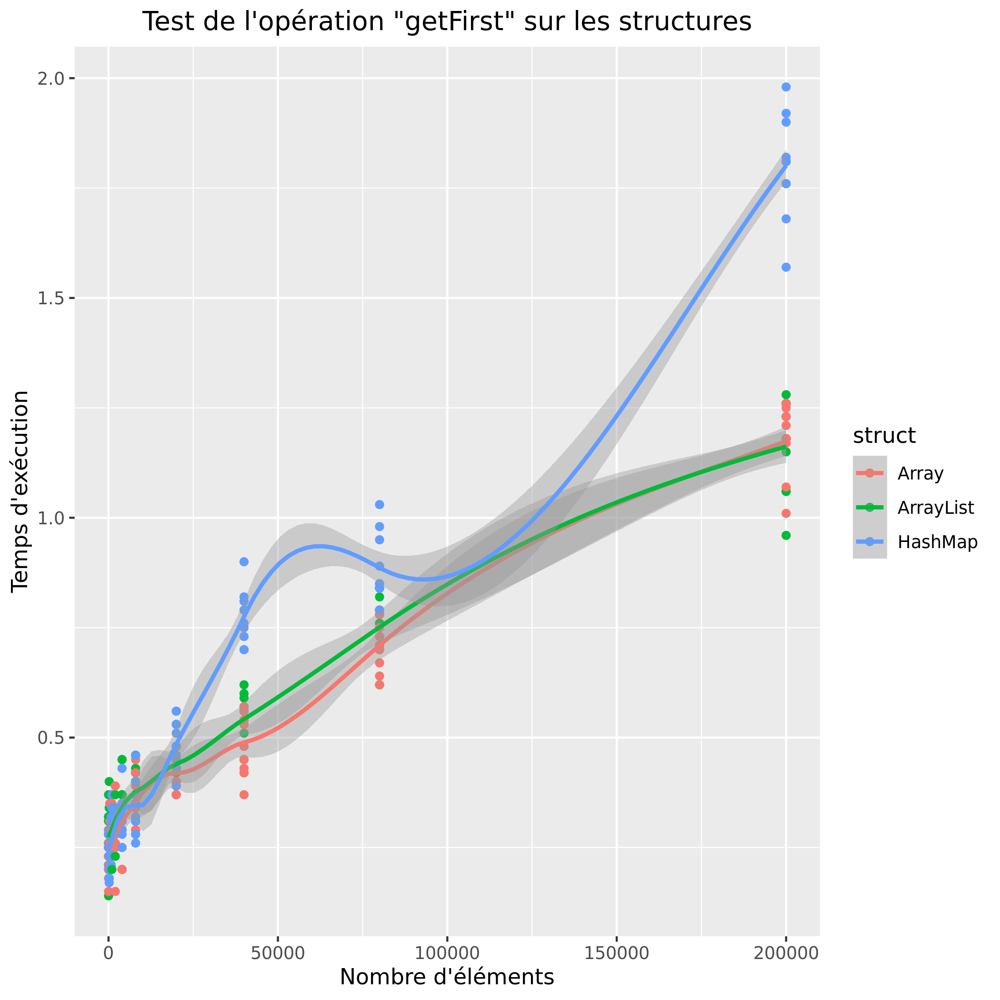
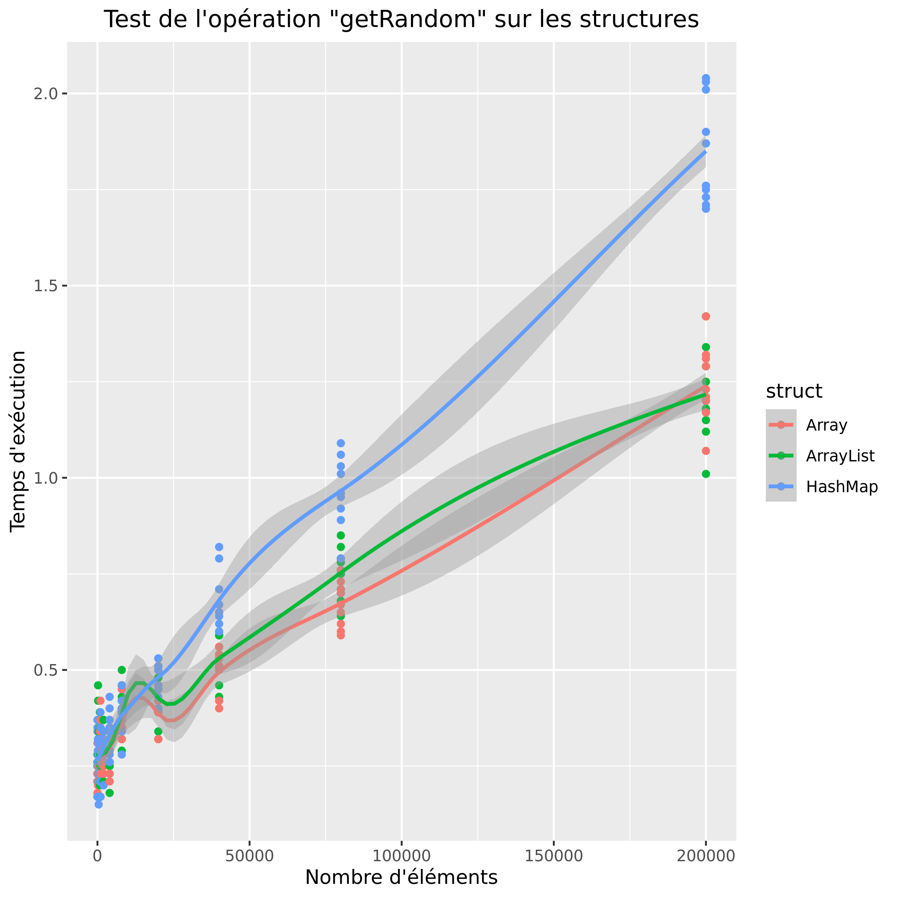
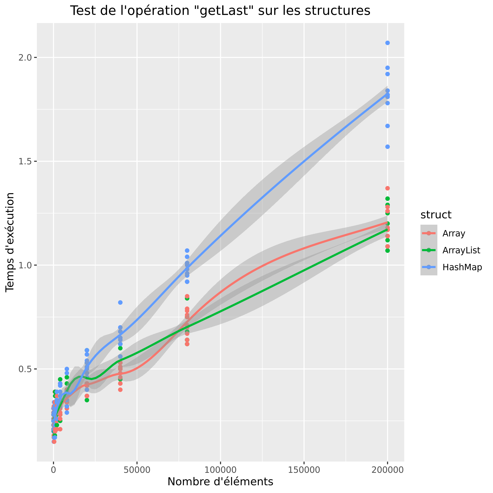
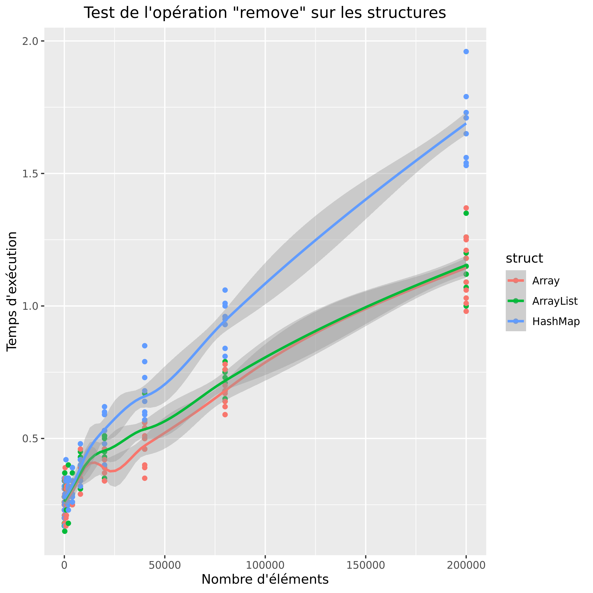

# P4a : Analyse de performances de différentes structures

[Grille d'évaluation P4a](https://docs.google.com/spreadsheets/d/1x72glVEQHPx56Wr8G0RNQgfQXGX6xCsjms_6b7J6si0/edit?usp=sharing
)

## Problème

Nous analysons dans cette étude les performances des différents type de structure en JAVA. Pour ce faire, nous allons tester les structures à travers plusieurs opérations, et comparer leur temp d'execution et leur alocation mémoire. 
Nous allons tester les trois structures suivantes : 
- "ArrayList"
- "HashMap"
- "Array"

Nous allons confronter ces structures à travers 5 opérations : 
- "contains"
- "remove"
- "getFirst"
- "getRandom" 
- "getLast"

Nous analysons dans cette étude les performances des différents type de structure en JAVA. Pour ce faire, nous allons tester les structures à travers plusieurs opération, et comparer leur temp d'execution et leur alocation mémoire. 

Nous allons tester les trois structures suivantes : "ArrayList", "HashMap" et "Array". 

Nous allons confronter ces structures à travers 5 opérations : "contains", "remove", "getFirst", "getRandom" et "getLast".

L'objectif de cette étude est d'aider à la décision lorsqu'il s'agira de choisir une structure de données. 

Quelle est la structure la plus performante dans tel ou tel contexte ?


## Dispositif expérimental

### Application

[code source de l'application](https://git.unistra.fr/nderousseaux/P4a/-/tree/master/src)
```
Usage : java testList structure operation taille

structure : Type de la structure, peut prendre les valeurs suivantes
    ArrayList
    HashMap
    Array

operation : Type d'opération testé sur la structure, peut prendre les valeurs suivantes :
    contains : Teste si une valeur apparait dans la structure. La valeur est définie aléatoirement.
    remove : Supprime toutes les occurences d'une certaine valeur dans la structure. La valeur est définie aléatoirement.
    getFirst : Accède au premier élément de la structure.
    getRandom : Accède a l'élément d'index n de la structure. n est définit aléatoirement.
    getLast : Accède au dernier élément de la structure.


taille : Taille de la structure.
```

### Environnement de test

Description de la plateforme de test :
```
cpu family      : 6
model name      : Intel(R) Atom(TM) x5-Z8350 CPU @ 1.44GHz
cpu MHz         : 1441.000
cache size      : 1024 KB
cpu cores       : 4
```

### Description de la démarche systématique

Description de la démarche systématique et de l'espace d'exploration pour chaque paramètres :

```
javac *.java


test() {

    res=`(/usr/bin/time -f"%U\t%M" java testList $1 $2 $3> /dev/null) 2>&1`
    echo -e "$1\t$2\t$3\t$res"
    echo -e "$1\t$2\t$3\t$res" >> ../graphs/results
}

rm ../graphs/results
touch ../graphs/results

randomMax=10000

echo -e "struct\toperation\tsize\ttmp\tmem" >> ../graphs/results

for taille in 10 200 400 800 1000 2000 4000 8000 20000 40000 80000 200000
do
    for struct in ArrayList Array HashMap
    do
        for operation in getFirst getRandom getLast remove contains
        do
            for itest in `seq 1 10`
            do
                test $struct $operation $taille
            done
        done
    done

done
```

Pour produire les données, il suffit de lancer le script.

Celui çi va lancer le programme "testList" pour chaque type de structure, pour chaque opération et pour différentes tailles, allant de 10 éléments, à 180 000 éléments.

Il va enregistrer le temps d'execution et l'allocation mesurés dans le fichier nommé "result" du dossier "graphs".
Il va faire ces opérations 10 fois, afin de pouvoir faire une moyenne.
On va devoir lancer le script R à la main pour générer les graphiques.

## Résultats préalables

### Temps d'exécution

| Opération            | Résultats                 |
|----------------------|---------------------------|
| contains             |  |
| getFirst             |  |
| getRandom            |  |
| getLast              |  |
| remove               |  |

### Consommation mémoire

| Opération            | Résultats                 |
|----------------------|---------------------------|
| contains             |  |
| getFirst             |  |
| getRandom            |  |
| getLast              |  |
| remove               |  |


### Analyse des résultats préalables

En observant les résulats on constate des différences de performances d'une structure à l'autre.

Du point de vue du temps processeur, la structure HashMap consomme beaucoup plus de temps processeur que les autres. On retrouve ceci sur toutes les opérations.
ArrayList est souvent plus lente que la structure Array, mais de peu. L'écart semble s'amplifier à mesure que le nombre d'éléments augmente. Cet ecart est aussi beaucoup moins présent sur les opérations get.

D'un point de vue de l'espace mémoire aloué, la aussi la structure HashMap est très gourmande. 
De la même manière que le temps processeur, Array demande moins de mémoire qu'ArrayList, y compris pour les opérations get.

### Discussion des résultats préalables

Ces résultats préalables sont facilement explicables. En effet, HashMap demande des opérations suplémentaire car elle prend en compte un couple clé/valeur, ce que ne font pas les structures Array et ArrayList.

Si Array prend moins de mémoire que ArrayList, c'est parceque ArrayList s'encombre de plusieurs informations pour stocker chaque case du tableau (la case suivante, la case précédente), alors qu'array ne stocke aucune de ces informations, il se contente de stocker ses données dans des cases mémoires contigue. C'est pourquoi il consomme moins de mémoire.


## Etude approfondie

### Hypothèse

Nous pouvons voir dans nos résultats préalables que l'évolution de Array et ArrayList sont très similaire en temp processeur.

Notre hypothèse sera la suivante :  Si l'on augmente le nombre d'éléments, on pourra observer un écart significatif de performances entre les structures Array et ArrayList?

### Protocole expérimental de vérification de l'hypothèse

Pour vériufier cela, nous allons modifier le script pour augmenter les tailles et tester uniquement ArrayList et Array sur l'opération getRandom.

```
#!/bin/bash

javac *.java


test() {

    res=`(/usr/bin/time -f"%U\t%M" java testList $1 $2 $3> /dev/null) 2>&1`
    echo -e "$1\t$2\t$3\t$res"
    echo -e "$1\t$2\t$3\t$res" >> ../graphs/results2
}

rm ../graphs/results2
touch ../graphs/results2

randomMax=10000

echo -e "struct\toperation\tsize\ttmp\tmem" >> ../graphs/results2

for taille in 200000 400000 600000 800000 1000000 2000000 20000000
do
    for struct in ArrayList Array
    do
        for operation in getRandom
        do
            for itest in `seq 1 10`
            do
                test $struct $operation $taille
            done
        done
    done

done

```

### Résultats expérimentaux


### Analyse des résultats expérimentaux

Nous pouvons voir qu'en effet, ArrayList est sensiblement plus lente qu'Array, en terme de temps processeur quand la taille est très grande.
De surcroit, comme on pouvait s'y attendre, elle prend beaucoup plus de mémoire que Array.

## Conclusion et travaux futurs

En conclusions, nous pouvons valider l'hypothèse, la structure ArrayList est moins performante que Array sur les grandes structures.
Cependant, elle permet l'implémentation de certaines méthodes que n'implémente pas Array. 

Nous aurions pu aussi tester une autre hypothèse : A partir d'une certaine taille, la structure HashMap devient-elle plus rapide qu'ArrayList sur l'opération getRandom. (J'ai testé l'hypothèse : non)